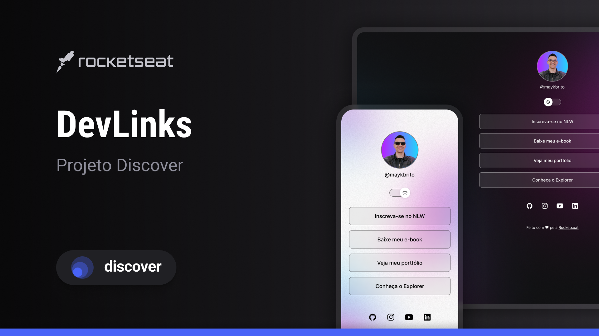

<h1 align="center"> Projeto Dev Links </h1>

Projeto ofertado pelo curso gratuito da plataforma Rockeseat.

  <a href="#-tecnologias">Tecnologias</a>&nbsp;&nbsp;&nbsp;|&nbsp;&nbsp;&nbsp;
  <a href="#-projeto">Projeto</a>&nbsp;&nbsp;&nbsp;|&nbsp;&nbsp;&nbsp;
  <a href="#-layout">Layout</a>&nbsp;&nbsp;&nbsp;|&nbsp;&nbsp;&nbsp;
  <a href="#memo-licença">Licença</a>
  <a href="#-atualizações">Atualizações</a>&nbsp;&nbsp;&nbsp;|&nbsp;&nbsp;&nbsp;

  

 

  

## 🚀 Tecnologias

Esse projeto foi desenvolvido com as seguintes tecnologias:

- HTML e CSS
- JavaScript
- Git e Github
- Figma

## 💻 Projeto

Este projeto visa disponibilizar os principais links/redes de uma pessoa, de forma objetiva e bonita, também contando com a opção de modo claro e escuro.

## 🔖 Layout

Você pode visualizar o layout do projeto através [DESSE LINK](https://www.figma.com/design/9q1nLqn9pSejVCATGzGLTO/DevLinks-%E2%80%A2-Projeto-Discover-(Community)?node-id=1437-191&t=MYDtVBxHd9zZ5B7T-0). É necessário ter conta no [Figma](https://figma.com) para acessá-lo.

## :memo: Licença

Esse projeto está sob a licença MIT.

## :memo: Atualizações
Algumas atualizações do projeto base foram feitas, por preferencias pessoais, aqui estão elas:
1. Classes ".dark" e ".light" adicionadas e separadas ao inves de usar ".root" e ".light"; 
2. Modo claro se encontra à esquerda do switch/toggle e modo escuro a direita do switch, assim seguindo a ordem "Do dia para a noite;
3. Shadow-box e outline, adicionados ao css(aprendi no google, pois tive curiosidade de como fazer o efeito "escurecer", e para gerar mais beleza e destacamento).
4. Um cachorro foi adicionado a imagem de perfil, pois este projeto tem a finalidade de aprendizagem do html, css e Java Script, sendo assim não julguei necessidade de colocar a minha foto.
5. Para que a imagem do cachorro ficasse boa, foi necessario redimensioná-la no css, aprendi pesquisando no google, para visualizar tal feito procure por #profile img

---

Feito com ♥ by Inácio Almeida com a tutoria da Rocketseat :wave:

# devLinks_proj_rockeseat
